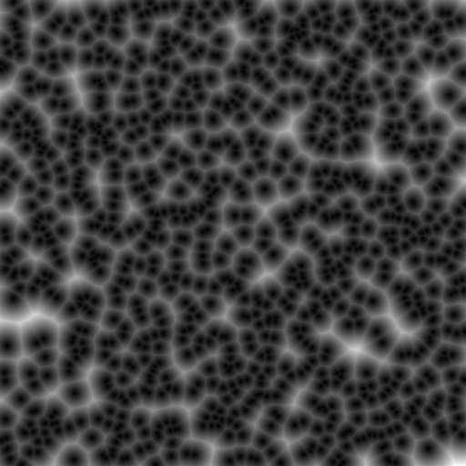
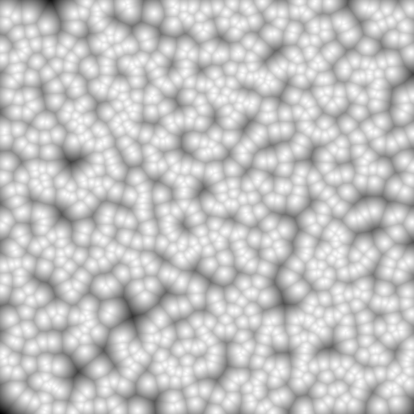
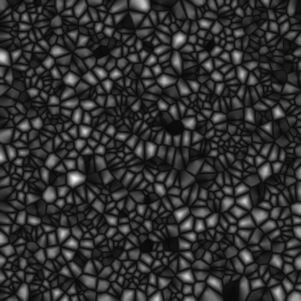

# Cellular Textures

|      Dotted Texture       |  Dotted Texture (Inverted Colors)  |      Scaly Texture       |
| :-----------------------: | :--------------------------------: | :----------------------: |
|  |  |  |

`ctext` is a command line utility that outputs a cellular texture as a grayscale
image. This project is an implementation of the procedure described in ["Making
Cellular Textures"][1]. Many [image formats][2] are supported including PNG,
JPEG, and Webp. See below for the program usage.

```bash
Generate cellular texture grayscale images.

Usage: ctext [OPTIONS] <WIDTH> <HEIGHT> <OUTPUT_FILE>

Arguments:
  <WIDTH>        image width in pixels
  <HEIGHT>       image height in pixels
  <OUTPUT_FILE>  output image path (e.g., /foo/bar/texture.png)

Options:
  -n, --num-texture-points <NUM_TEXTURE_POINTS>
          number of texture points [default: 1000]
  -p, --num-neighbors <NUM_NEIGHBORS>
          number of neighbors to consider per pixel [default: 1]
  -i, --invert-colors
          invert colors of output image
  -d, --dist-op <DIST_OP>
          distance operation to use [default: add] [possible values: add, subtract, multiply, divide]
  -h, --help
          Print help (see more with '--help')
  -V, --version
          Print version
```

### Generating Images

To generate the images at the top of this README, run the following commands:

Dotted texture:

```
ctext 512 512 dotted.png -d multiply -p 1
```

Dotted texture with inverted colors:

```
ctext 512 512 dotted_inverted.png -d multiply -p 1 -i
```

Scaly texture:

```
ctext 512 512 scaly.png -d subtract -p 2 -i
```

[1]: https://blackpawn.com/texts/cellular/default.html#:~:text=Making%20Cellular%20Textures&text=These%20textures%20are%20all%20based,values%20to%20determine%20a%20color.
[2]: https://github.com/image-rs/image/blob/main/README.md#supported-image-formats
