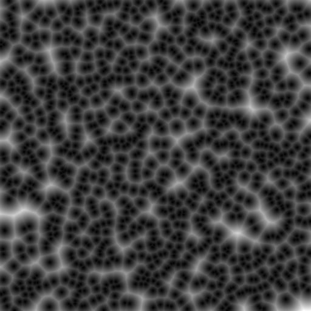
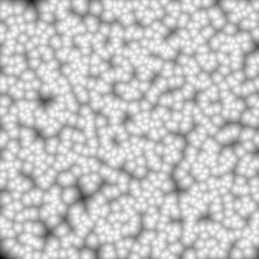
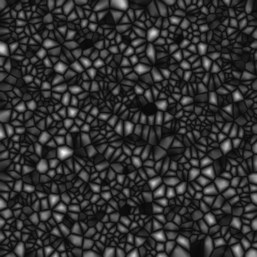

# Cellular Textures

A commandline utility that outputs a cellular texture as a grayscale PNG. This
project is an implementation of the procedure described in ["Making Cellular
Textures"][1].

|      Dotted Texture       |  Dotted Texture (Inverted Colors)  |      Scaly Texture       |
| :-----------------------: | :--------------------------------: | :----------------------: |
|  |  |  |

### Building

To build this project you'll need CMake3.15+, Boost, and libPNG developer libs.

To confgiure the project run

```bash
cmake --preset <PRESET>
```

where `<PRESET>` is any one of `release`, `debug`, and `debug-valgrind`.

To build and install the binaries run

```bash
cmake --build --preset <PRESET> --target install
```

On success, CMake will install all binaries to `cellular_textures/bin/<PRESET>/`.

### Generating Images

`ctext` is a commandline utility. You can print the usage message below at any
time by running `ctext` with the `--help/-h` option:

```
usage: ctext WIDTH HEIGHT FILEPATH [OPTION]...
Allowed options:
  -h [ --help ]                     print this help message
  -n [ --num-points ] arg (=1000)   number of texture points
  -i [ --invert-colors ] [=arg(=1)] invert-pixel-color
  -t [ --enable-tiling ] [=arg(=1)] tile textures
  -k [ --num-neighbors ] arg (=1)   number of neighboring texture points to
                                    consider at each pixel
  -d [ --dist-op ] arg (=+)         operation applied to all neighboring point
                                    distances:
                                    +) Add
                                    -) Subtract
                                    *) Multiply
```

To generate the images at the top of this help page, run the following commands:

Scaly texture:

```
ctext 512 512 out.png -d "-" -k 2
```

Dotted texture:

```
ctext 512 512 out.png -d "*" -k 1
```

Dotted texture with inverted colors:

```
ctext 512 512 out.png -d "*" -k 1 -i
```

### Resources

- ["Making Cellular Textures"][1]: This article was the inspiration for this
  project and the basic guide for the implementation.
- [kdtree][2]: gvd's header-only K-D Tree implementation is used in this
  project. See [include/kdtree.h](include/kdtree.h)

[1]: https://blackpawn.com/texts/cellular/default.html#:~:text=Making%20Cellular%20Textures&text=These%20textures%20are%20all%20based,values%20to%20determine%20a%20color.
[2]: https://github.com/gvd/kdtree
